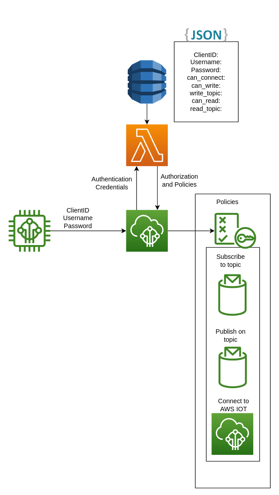

# Lambda Authorizer
[](https://github.com/SrzStephen/python-aws-iot-custom-authorizer/actions/workflows/basic_test.yml)
### Motivation

AWS normally needs you to use [x509 certificate based authentication](https://docs.aws.amazon.com/iot/latest/developerguide/x509-client-certs.html)
to connect to AWS IOT. This certificate based Authention can be a bit of a pain when it comes to things that expect
Username/Password authentication like [Tasmota](https://tasmota.github.io/docs/AWS-IoT/#1-prerequisites), or cases
where you don't really want some of the advanced AWS IOT features and realistically just want something for your IOT 
devices to pubsub to.

In these cases you can use an [AWS Custom Authorizer](https://docs.aws.amazon.com/iot/latest/developerguide/custom-authentication.html)
to handle the authentication side of things for you.

### Documentation
I found that the documentation for how to create and use the custom authorizer was a bit lacking, particularly because
there are a few gotchas when it comes to [MQTT authentication](https://docs.aws.amazon.com/iot/latest/developerguide/custom-auth.html),
and it seems like some of the stackoverflow questions are no longer relevent due to things like ATS endpoint changes.

I've included tests in `tests/integration/test_live_mqtt` which should clear up how clients can connect via python
(using `paho` and the `aws-iot` libraries), with the hope that I get around to a C++ example using [pubsubclient](https://github.com/knolleary/pubsubclient)
when I finish off my esp32 integration.

### Custom Authorizer
An AWS custom authorizer basically gets the credentials forwarded from AWS IOT Core

```json
{
  "protocolData": {
    "mqtt": {
      "username": "USER_NAME",
      "password": "PASS_WORD",
      "clientId": "CLIENT_NAME"
    }
  },
  "protocols": [
    "mqtt"
  ],
  "signatureVerified": false,
  "connectionMetadata": {
    "id": "d0adaaa7-b22d-4545-923c-68a7ae2e337c"
  }
}
```

The Authorizer (Lambda) then has the job of figuring out whether a device should be authorized to connect, and what
IOT policies it should have.

### Implementation

I wanted a simple serverless solution to maintain and design because I'm kind of lazy.


The Lambda function acting as the authorizer will look for the attributes associated with the key for the `Client_ID`,
out of those attributes it will get a `Username` and `password` to figure out whether the credentials that it's using
are valid, and will also retireve a set of attributes `can_write` `write_topic` `can_read` `read_topic` `can_connect`
for use in generating the IAM policy document for permissions that get passed to AWS IOT Core.

This allows a serverless way to provision new devices (Add a new Client_ID and attributes) to the DynamoDB table,
and by using [MQTT wildcards](https://www.hivemq.com/blog/mqtt-essentials-part-5-mqtt-topics-best-practices/) in the 
`read_topic` and `write_topic` it allows you to properly namespace your topics.

### Testing

#### Unit testing
The unit testing uses a set of known good events to make sure that the lambda function works as intended before being
deployed to AWS. The testing makes heavy use of the `moto` library to make mocking dynamodb calls and inserting fake
data for testing purposes as easy as possible.

#### Integration testing

The integration testing calls the `test-invoke-lambda-authorizer` to ensure that the authorizer works as expected as
far as being set up, and whether it provides the right response (Including whether the Policy Document is correctly formed).

The integration testing also has two basic tests for the `aws-iot-sdk` and `paho` clients to ensure that a device
can properly connect without the abstraction layer provided by `test-invoke-lambda-authorizer`. This also serves as
documentation for how to connect using the custom authorizer.

### What Next

#### Token signing

Right now one of the limitations is tha I haven't implemented Token Signing yet, from the AWS page:
> If you leave signing enabled, you can prevent excessive triggering of your Lambda by unrecognized clients. Consider
> this before you disable signing in your authorizer.

I'll eventually get around to adding this as a new export in the Cloudformation and use `UnsignedAuthorizerStatus` to
control whether the Unsigned Authorizer is enabled/disabled.

#### HTTP support

I've set up the custom authorizer for MQTT authentication, but it also supports HTTP. This is a pretty simple addition
to the authorizer lambda, but I don't have a need for it yet, so it's a #TODO for later.


#### Demo with Arduino (ESP32)

Part of the reason that I made this was for my IOT projects so I will eventually add in a C++ example using [pubsubclient](https://github.com/knolleary/pubsubclient)
when I finish off my esp32/esp8266 integrations.

#### Github Actions integration

I've got some decent testing so it shouldn't be hard to have a proper staging and prod environment with CI that
auto rolls back on failure.

